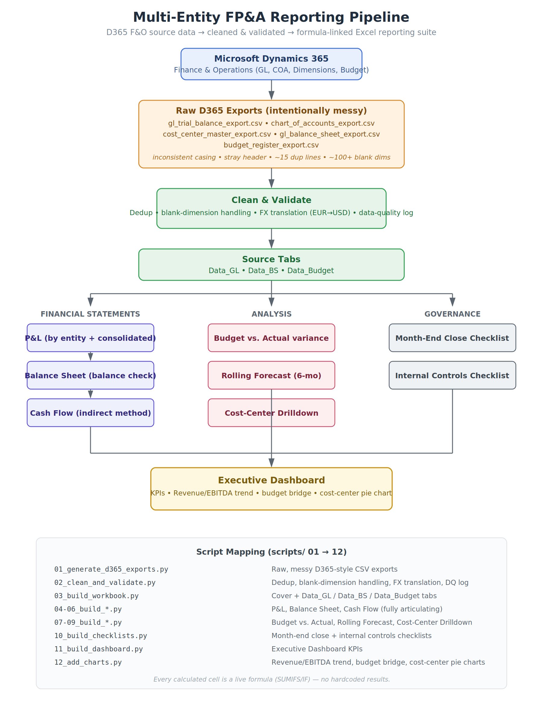
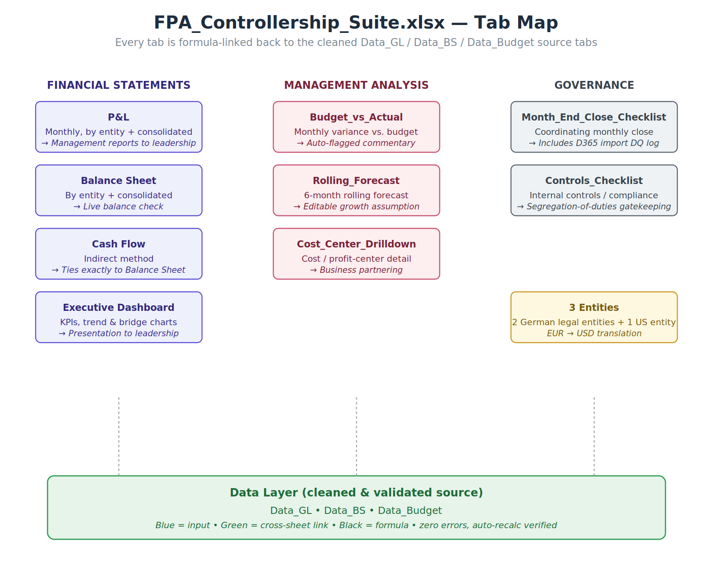

# Multi-Entity FP&A & Controllership Reporting Suite



## Skills Demonstrated

**Finance / FP&A**
- Month-end close coordination & data validation
- 3-statement modeling (P&L, Balance Sheet, Cash Flow — fully articulating)
- Budget vs. Actual variance analysis
- Rolling forecast methodology
- Cost/profit-center business partnering
- Internal controls & segregation-of-duties design
- Multi-entity / multi-currency consolidation (EUR → USD translation)

**Technical**
- Python (pandas, numpy) — ETL pipeline, data cleaning, FX conversion
- openpyxl — formula-driven Excel generation, conditional formatting, charts
- Excel — SUMIFS-based dynamic reporting, dropdown selectors, data validation
- Source system knowledge — Microsoft Dynamics 365 Finance & Operations (GL, chart of accounts, financial dimensions, budget register)



A simulated month-end close, budgeting, forecasting, and management reporting package for a 3-entity group (2 German legal entities + 1 US entity), built the way a Controller / FP&A Analyst would actually run it: pull raw data from the ERP, validate it, then drive a fully formula-linked 3-statement model and reporting pack in Excel.

This project is a companion to my [D2C Sales Pricing Dashboard](https://github.com/KowshithaSrinivas/d2c-sales-pricing-dashboard) — that one is commercial/pricing analytics; this one is built specifically around Controller / FP&A Analyst job requirements (month-end close, budget vs. actual, forecasting, business partnering, internal controls).

## Source system: Microsoft Dynamics 365 Finance & Operations

The `/data/d365_raw_exports` folder simulates the raw files a Controller would pull out of D365 F&O each month:

| File | D365 F&O source (real-world equivalent) |
|---|---|
| `gl_trial_balance_export.csv` | General ledger > Trial balance, or the `GeneralJournalAccountEntry` OData entity |
| `chart_of_accounts_export.csv` | `MainAccount` entity |
| `cost_center_master_export.csv` | Financial dimension export (`DimensionFinancialTag`) |
| `gl_balance_sheet_export.csv` | General ledger closing balances by main account |
| `budget_register_export.csv` | `LedgerBudgetRegisterEntry` entity |

The exports are intentionally messy in the same ways real D365 pulls are: inconsistent entity-code casing, a stray whitespace column header, ~15 duplicate journal lines, and ~100+ lines with a blank cost-center dimension that need to be triaged before they can be reported on.

**Connecting to a live D365 environment:** in production, `scripts/01_generate_d365_exports.py` would be replaced with a pull against the D365 F&O OData or Data Management Framework REST API, e.g.:

```python
import requests
resp = requests.get(
    "https://<your-org>.operations.dynamics.com/data/GeneralJournalAccountEntries",
    headers={"Authorization": f"Bearer {token}"},
    params={"$filter": "TransDate ge 2025-01-01"}
)
```

using an Azure AD app registration (client credentials flow) scoped to the F&O environment. The cleaning/validation and Excel-build logic downstream is identical either way — that's the point of separating extraction from transformation.

## Pipeline

```
scripts/01_generate_d365_exports.py   → raw, messy D365-style CSV exports
scripts/02_clean_and_validate.py      → dedup, blank-dimension handling, FX translation, data-quality log
scripts/03_build_workbook.py          → Cover + Data_GL / Data_BS / Data_Budget source tabs
scripts/04_build_pnl.py               → P&L (entity selector + consolidated)
scripts/05_build_balance_sheet.py     → Balance Sheet (entity selector + consolidated, balance check)
scripts/06_build_cash_flow.py         → Indirect-method Cash Flow (ties to Balance Sheet exactly)
scripts/07_build_budget_vs_actual.py  → Monthly variance analysis with commentary flags
scripts/08_build_rolling_forecast.py  → 6-month rolling forecast, editable growth assumption
scripts/09_build_cost_center.py       → Cost-center drilldown for business partnering
scripts/10_build_checklists.py        → Month-end close checklist + internal controls checklist
scripts/11_build_dashboard.py         → Executive Dashboard KPIs
scripts/12_add_charts.py              → Revenue/EBITDA trend, budget bridge, cost-center pie charts
```

Run in order to regenerate `model/FPA_Controllership_Suite.xlsx` from scratch.

## What's in the workbook

| Tab | Maps to this Controller/FP&A responsibility |
|---|---|
| **Executive_Dashboard** | Monthly management reports and presentations to leadership |
| **P&L** | Monthly P&L by entity + consolidated |
| **Balance_Sheet** | Monthly balance sheet by entity + consolidated, with a live balance check |
| **Cash_Flow** | Cash-flow analysis, indirect method, fully derived from P&L + Balance Sheet |
| **Budget_vs_Actual** | Monthly variance analysis vs. budget/forecast, with auto-flagged commentary |
| **Rolling_Forecast** | Forecast process — trailing trend + adjustable growth assumption |
| **Cost_Center_Drilldown** | Business partnering with cost/profit-center owners |
| **Month_End_Close_Checklist** | Coordinating the monthly close with Shared Services; includes the data-quality log from the D365 import |
| **Controls_Checklist** | Acting as gatekeeper of internal controls / compliance |
| **Data_GL / Data_BS / Data_Budget** | Cleaned source data everything above is formula-linked to |

**Modeling standards followed:** every calculated cell is a live Excel formula (SUMIFS/IF, no hardcoded results), blue = input, green = cross-sheet link, black = formula, one-decimal percentages, parentheses for negatives, zero formula errors verified via automated recalculation.

## Tech stack

- **Python (pandas, numpy)** — synthetic D365 export generation, ETL/cleaning, FX translation
- **openpyxl** — formula-driven Excel workbook construction, conditional formatting, native charts
- **Excel** — the actual deliverable: dropdown entity/period selectors, SUMIFS-driven reporting, a self-checking 3-statement model

## Extending this project

- Swap the synthetic generator for a live D365 F&O OData pull (see snippet above)
- Add Power BI on top of `Data_GL` / `Data_BS` for a browser-based version of the same dashboard
- Parameterize the number of entities/currencies for a larger group structure
